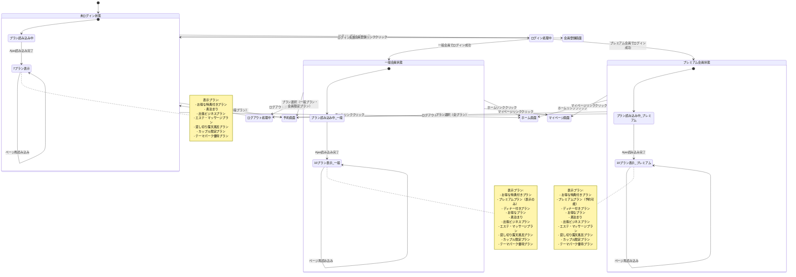
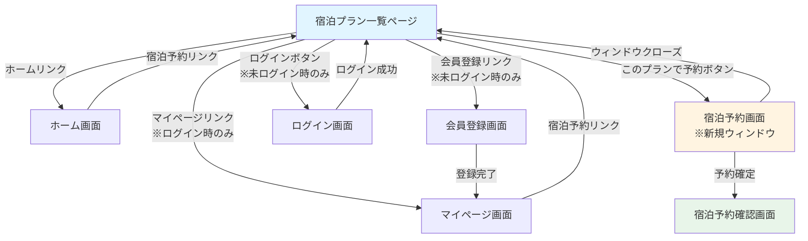
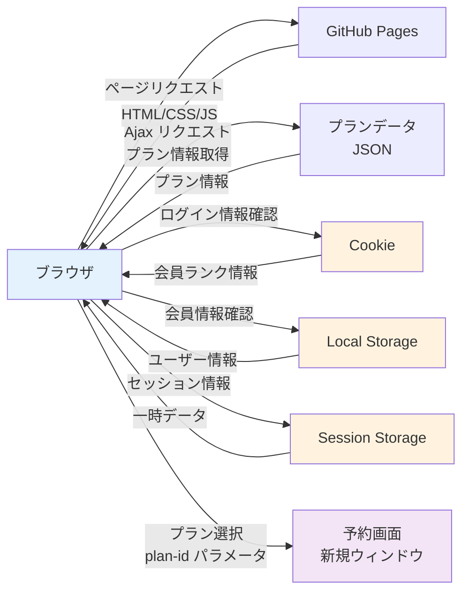

# 宿泊プラン一覧ページ - 機能一覧

## 1. 概要

**ページURL**: https://hotel-example-site.takeyaqa.dev/ja/plans.html  
**ページタイトル**: 宿泊プラン一覧 | HOTEL PLANISPHERE - テスト自動化練習サイト

宿泊プラン一覧ページは、ホテルの各種宿泊プランを表示し、ユーザーが予約を行うための起点となるページです。会員ランク（未ログイン、一般会員、プレミアム会員）によって表示されるプランが動的に変化する仕様となっています。

---

## 2. 主要機能

### 2.1 ナビゲーション機能
ページ上部に共通ナビゲーションメニューが配置されています。

| 項目 | 種類 | 遷移先 | 備考 |
|---|---|---|---|
| ホーム | リンク | ./index.html | トップページへ戻る |
| 宿泊予約 | リンク | ./plans.html | 現在のページ（宿泊プラン一覧） |
| 会員登録 | リンク | ./signup.html | 未ログイン時のみ表示 |
| マイページ | リンク | ./mypage.html | ログイン時のみ表示 |
| ログイン | ボタン | ログインモーダル/画面 | 未ログイン時のみ表示 |
| ログアウト | ボタン | - | ログイン時のみ表示 |

### 2.2 プラン表示機能
ユーザーの会員ランクに応じて、異なるプランが表示されます。プラン情報はAjax（非同期通信）で読み込まれます（おすすめプランを除く）。

#### 2.2.1 表示制御ロジック

| 会員ランク | 表示プラン数 | 特徴 |
|---|---|---|
| 未ログイン | 7プラン | おすすめプラン + 一般プラン6件 |
| 一般会員 | 10プラン | おすすめプラン + 会員限定プラン2件 + プレミアム会員限定プラン1件（表示のみ） + 一般プラン6件 |
| プレミアム会員 | 10プラン | おすすめプラン + 会員限定プラン2件 + プレミアム会員限定プラン1件（予約可能） + 一般プラン6件 |

---

## 3. プラン一覧詳細

### 3.1 おすすめプラン（全ユーザー対象）

#### お得な特典付きプラン (plan-id=0)
- **バッジ**: ⭐おすすめプラン⭐ / 本日限り
- **料金**: 大人1名 7,000円
- **最小人数**: 1名様から
- **部屋タイプ**: スタンダードツイン
- **予約リンク**: ./reserve.html?plan-id=0

### 3.2 プレミアム会員限定プラン

#### プレミアムプラン (plan-id=1)
- **バッジ**: ❤️プレミアム会員限定❤️
- **料金**: 大人1名 10,000円
- **最小人数**: 2名様から
- **部屋タイプ**: プレミアムツイン
- **予約リンク**: ./reserve.html?plan-id=1
- **表示条件**: プレミアム会員でログイン時のみ予約可能

### 3.3 会員限定プラン

#### ディナー付きプラン (plan-id=2)
- **バッジ**: 会員限定
- **料金**: 大人1名 8,500円
- **最小人数**: 1名様から
- **部屋タイプ**: 部屋指定なし
- **予約リンク**: ./reserve.html?plan-id=2
- **表示条件**: 一般会員以上

#### お得なプラン (plan-id=3)
- **バッジ**: 会員限定
- **料金**: 大人1名 6,000円
- **最小人数**: 1名様から
- **部屋タイプ**: 部屋指定なし
- **予約リンク**: ./reserve.html?plan-id=3
- **表示条件**: 一般会員以上

### 3.4 一般プラン（全ユーザー対象）

#### 素泊まり (plan-id=4)
- **料金**: 大人1名 5,500円
- **最小人数**: 1名様から
- **部屋タイプ**: シングル
- **予約リンク**: ./reserve.html?plan-id=4

#### 出張ビジネスプラン (plan-id=5)
- **料金**: 大人1名 7,500円
- **最小人数**: 1名様から
- **部屋タイプ**: シングル
- **予約リンク**: ./reserve.html?plan-id=5

#### エステ・マッサージプラン (plan-id=6)
- **料金**: 大人1名 9,000円
- **最小人数**: 1名様から
- **部屋タイプ**: 部屋指定なし
- **予約リンク**: ./reserve.html?plan-id=6

#### 貸し切り露天風呂プラン (plan-id=7)
- **料金**: 大人1名 9,000円
- **最小人数**: 1名様から
- **部屋タイプ**: 部屋指定なし
- **予約リンク**: ./reserve.html?plan-id=7

#### カップル限定プラン (plan-id=8)
- **料金**: 大人1名 8,000円
- **最小人数**: 2名様から
- **部屋タイプ**: プレミアムツイン
- **予約リンク**: ./reserve.html?plan-id=8

#### テーマパーク優待プラン (plan-id=9)
- **料金**: 大人1名 10,000円
- **最小人数**: 1名様から
- **部屋タイプ**: 部屋指定なし
- **予約リンク**: ./reserve.html?plan-id=9

---

## 4. プラン表示パターン

### 4.1 未ログイン時の表示プラン
```
1. お得な特典付きプラン (plan-id=0) ⭐おすすめ⭐
2. 素泊まり (plan-id=4)
3. 出張ビジネスプラン (plan-id=5)
4. エステ・マッサージプラン (plan-id=6)
5. 貸し切り露天風呂プラン (plan-id=7)
6. カップル限定プラン (plan-id=8)
7. テーマパーク優待プラン (plan-id=9)
```
**合計**: 7プラン

### 4.2 プレミアム会員ログイン時の表示プラン
```
1. お得な特典付きプラン (plan-id=0) ⭐おすすめ⭐
2. プレミアムプラン (plan-id=1) ❤️プレミアム会員限定❤️
3. ディナー付きプラン (plan-id=2) 会員限定
4. お得なプラン (plan-id=3) 会員限定
5. 素泊まり (plan-id=4)
6. 出張ビジネスプラン (plan-id=5)
7. エステ・マッサージプラン (plan-id=6)
8. 貸し切り露天風呂プラン (plan-id=7)
9. カップル限定プラン (plan-id=8)
10. テーマパーク優待プラン (plan-id=9)
```
**合計**: 10プラン

---

## 5. 技術仕様

### 5.1 データ読み込み
- **初期表示**: おすすめプラン（plan-id=0）は静的に表示
- **非同期読み込み**: その他のプランはAjax（非同期通信）で動的に読み込み
- **読み込み中表示**: "Loading..." というステータス表示

### 5.2 認証状態の管理
- **ログイン情報の保存先**: Cookie
- **会員ランクの判定**: Cookieに保存されたログイン情報を基に判定
- **未ログイン時**: 会員限定プランは非表示

### 5.3 レスポンシブデザイン
- モバイルブラウザでも表示可能
- プランカードはグリッドレイアウトで配置

---

## 6. ユーザーインタラクション

### 6.1 プラン予約
各プランには「このプランで予約」ボタンが配置されており、クリックすると予約画面に遷移します。

- **遷移先**: ./reserve.html?plan-id={プランID}
- **遷移方法**: 新規ウィンドウで開く
- **パラメータ**: URLクエリパラメータとしてplan-idが渡される

### 6.2 ログイン/ログアウト
- **ログインボタン**: クリックでログイン画面へ遷移
- **ログアウトボタン**: クリックでログアウト処理を実行

---

## 7. テスト観点

### 7.1 機能テスト
- [ ] 未ログイン時に7プランが表示されること
- [ ] プレミアム会員ログイン時に10プランが表示されること
- [ ] 一般会員ログイン時に会員限定プランが表示されること
- [ ] 各プランの「このプランで予約」ボタンが正しく機能すること
- [ ] プランIDが正しくURLパラメータとして渡されること

### 7.2 表示テスト
- [ ] おすすめプランバッジが正しく表示されること
- [ ] プレミアム会員限定バッジが正しく表示されること
- [ ] 会員限定バッジが正しく表示されること
- [ ] 各プランの料金、人数、部屋タイプが正しく表示されること

### 7.3 非同期処理テスト
- [ ] Ajax読み込み中に"Loading..."が表示されること
- [ ] Ajax読み込み完了後にプランが正しく表示されること
- [ ] ネットワークエラー時の挙動確認

### 7.4 権限テスト
- [ ] 未ログイン時にプレミアム会員限定プランが非表示であること
- [ ] 一般会員時にプレミアム会員限定プランが表示されること（予約可否は別途確認）
- [ ] プレミアム会員時に全プランが予約可能であること

---

## 8. 状態遷移図

### 8.1 ページ状態遷移図（Mermaid形式）



### 8.2 プラン表示状態の詳細

#### 状態一覧

| 状態名 | 説明 | 表示プラン数 | 予約可能プラン |
|---|---|---|---|
| 未ログイン状態 | ログインしていない状態 | 7プラン | 一般プラン（plan-id: 0,4-9） |
| 一般会員状態 | 一般会員でログインしている状態 | 10プラン | 一般プラン + 会員限定プラン（plan-id: 0,2-9） |
| プレミアム会員状態 | プレミアム会員でログインしている状態 | 10プラン | 全プラン（plan-id: 0-9） |
| プラン読み込み中 | Ajax通信中の状態 | - | "Loading..."表示 |

#### 状態遷移トリガー

| トリガー | 遷移元 | 遷移先 | 条件 |
|---|---|---|---|
| ページ初回アクセス | - | 未ログイン状態 | Cookieにログイン情報なし |
| ページ初回アクセス | - | 一般会員状態 | Cookieに一般会員情報あり |
| ページ初回アクセス | - | プレミアム会員状態 | Cookieにプレミアム会員情報あり |
| ログインボタンクリック | 未ログイン状態 | ログイン処理中 | - |
| ログイン成功 | ログイン処理中 | 一般会員状態/プレミアム会員状態 | 認証成功 |
| ログアウトボタンクリック | 一般会員状態/プレミアム会員状態 | ログアウト処理中 | - |
| ログアウト完了 | ログアウト処理中 | 未ログイン状態 | Cookie削除完了 |
| プラン選択 | 任意の状態 | 予約画面 | 「このプランで予約」クリック |
| Ajax読み込み完了 | プラン読み込み中 | プラン表示状態 | 非同期通信完了 |

### 8.3 画面遷移図



### 8.4 データフロー図



---

## 9. 関連ページ
- **ホーム**: ./index.html
- **ログイン**: ./login.html
- **会員登録**: ./signup.html
- **マイページ**: ./mypage.html
- **宿泊予約**: ./reserve.html?plan-id={プランID}

---

## 10. 備考
- プラン情報はサーバー側ではなくブラウザのストレージ（Cookie、Local Storage、Session Storage）で管理
- 負荷テストには利用不可
- GitHub Pagesでホスティング
- レスポンシブデザイン対応

---

**作成日**: 2025年11月24日  
**最終更新**: 2025年11月24日  
**バージョン**: 1.0
